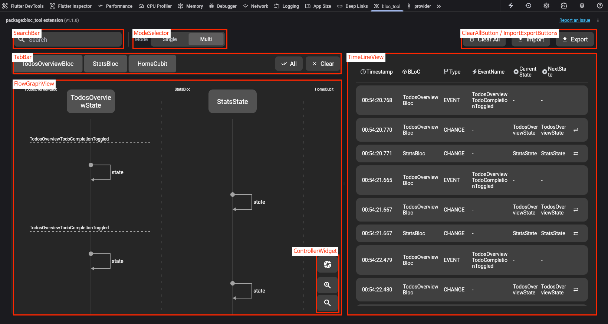
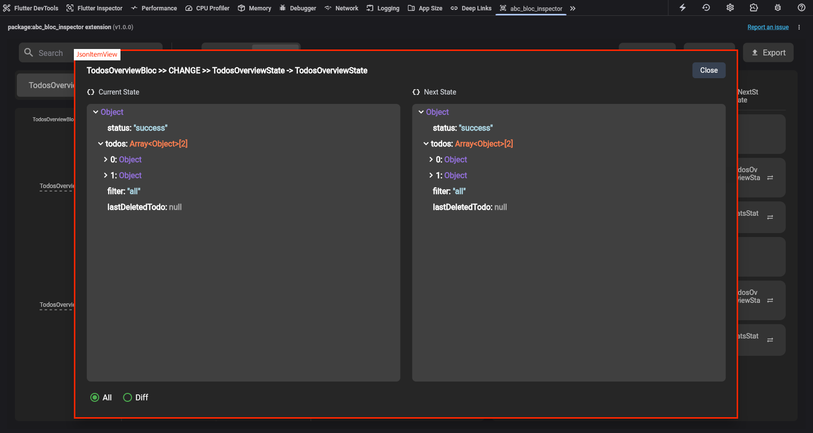
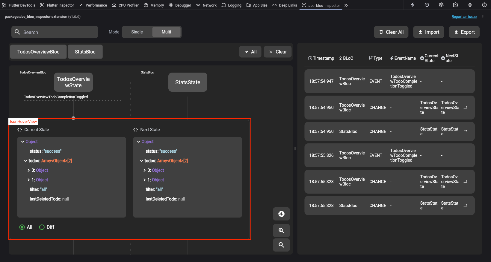
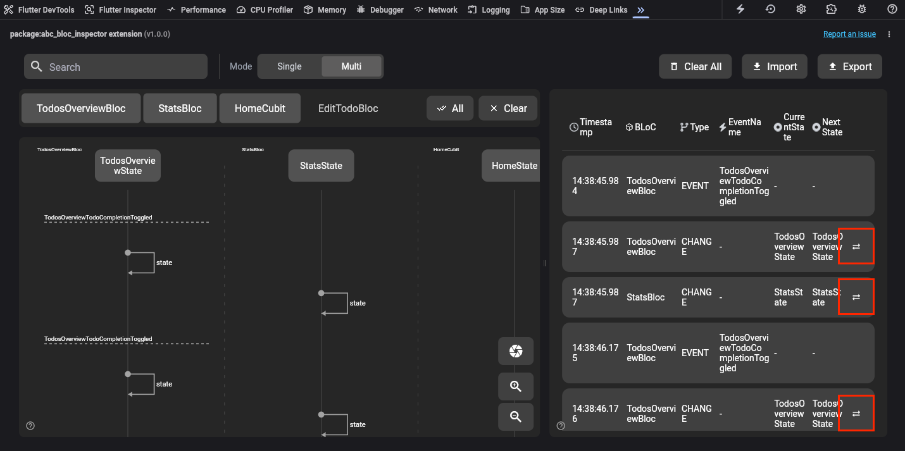

# ABC Bloc Inspector DevTools Extension

The ABC Bloc Inspector DevTools Extension is a powerful tool designed to enhance the debugging and visualization of bloc state management in Flutter applications. By providing a comprehensive suite of utilities, this extension simplifies the process of tracking and analyzing state changes, making it an invaluable resource for developers aiming to build robust and maintainable Flutter applications.

## Features

- **Flow Graph Visualization**: Provides a dynamic and interactive visualization of bloc states and events, allowing developers to easily trace and debug the flow of data through their applications.
- **State Overwriting with `StateReplayBloc`**: Enables developers to overwrite and replay states within their applications, facilitating advanced debugging and testing scenarios.
- **Real-time Event Tracking**: Monitor and log events in real-time to gain insights into application behavior and performance.
- **Customizable Debugging Tools**: Offers a range of customizable tools to tailor the debugging experience to specific project needs.


## Components Overview
- Main

   

- JsonItemView<br>
   The JsonItemView can see the details and compare before/after state changes by double tap on TimelineView.

   

- JsonHoverView<br>
   The JsonHoverView can see the details and compare before/after state changes by hovering state on FlowGraphView.

   

- State Overwrite Component<br>
   The bloc instance using `StateReplayBloc` is active, the state overwriting component is shown.
   It helps that it can change the current state to the clicked state by tapping.

   


### Prerequisites

We recommend using Flutter Version 3.27.3+
- [Flutter SDK](https://flutter.dev/docs/get-started/install)


### Installation

1. Clone the repository:
    ```sh
    git clone https://github.com/line/abc-bloc-inspector
    ```
2. Navigate to the project directory:
    ```sh
    cd packages/abc_bloc_inspector_devtools_extension
    ```
3. Install dependencies:
    ```sh
    flutter pub get
    ```
4. Run the code generator:
   ```sh
   dart run build_runner build watch
   ```

### Running the DevTools Extension

To run the app on an emulator, use the following command:
```sh
flutter run -d chrome --dart-define=use_simulated_environment=true
```


### Build and Deploy

To run the build and deploy, use the following command:
```sh
dart run devtools_extensions build_and_copy --source=. --dest=/your_project/extension/devtools/
```

## Contributing Guidelines

For more information, contributions, or to report issues, please read the [contributing guidelines](./CONTRIBUTING.md). We welcome contributions and feedback from the community to improve and expand the capabilities of Bloc Tool.

## License

See the [LICENSE](LICENSE) file for more details.
